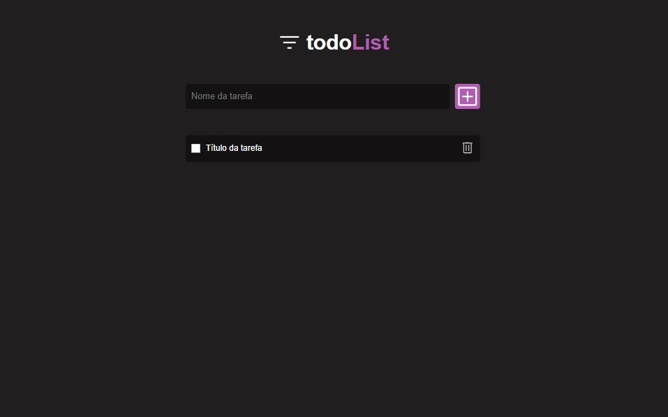

<h1 align="center">todoList</h1>

A sua lista de tarefas virtual, crie e exclua tarefas de uma maneira rápida e prática.

## 🔎| Visualize
Visualize o resultado atual do projeto:

- [GitHub Pages](https://wesley-nilton.github.io/todolist/)

## 🛸| Tecnologias
Na construção do projeto foram utilizadas as seguintes tecnologias:

- [HTML](https://developer.mozilla.org/pt-BR/docs/Web/HTML)
- [CSS](https://developer.mozilla.org/pt-BR/docs/Web/CSS)
- [JavaScript](https://developer.mozilla.org/pt-BR/docs/Web/JavaScript)

## 🎯| Bibliotecas
Na construção do projeto foram utilizadas as seguintes bibliotecas:

- [Google Fonts](https://fonts.google.com/)

## 👥| Autor(es)
Autores e contribuidores do projeto:

- [Wesley Nilton](https://github.com/Wesley-Nilton)